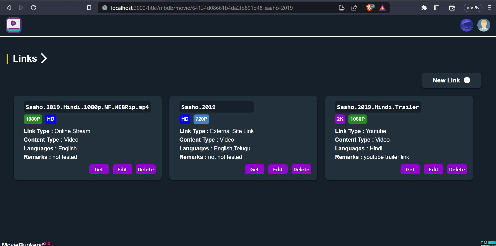

# react4movies :clapper:

[](https://github.com/charan379/moviebunkers) [](https://github.com/charan379/react4movies) [](https://www.gnu.org/licenses/agpl-3.0.en.html)
[](https://app.netlify.com/sites/moviebunkers01/deploys)

React/NextJs based web client for [MovieBunkers](https://github.com/charan379/moviebunkers)

## `Features`

- Add movies to collection from tmdb
- Search movies
- Know where movie is available for streaming
- Play Youtube Trailers
- Filters
  - filter by language
  - filter by genre
  - filter by movie/tv
  - filter by Age/Film Board Certification
  - filter by seen/unseen
  - filter by favourite
  - filter by starred
- Sort
  - year asc
  - year desc
  - added asc
  - added desc
- Set movie as seee, unseen, star, favourite
- Toggle between light/dark themes
- Multi user view
  - Guest
  - User
  - Moderator
  - Admin

## Keyboard Shortcuts

- CTRL+Q => Opens Sidebar, If sidebar already opened focus search field
- CTRL+D => Clears all filters and search query
- Esc => closes sidebar, movie modal

## Screenshots





## Installation

##### Environment Variables

To run this project, you will need to add the following environment variables to your .env file

`GENERATE_SOURCEMAP`  
`NEXT_PUBLIC_MOVIEBUNKERS_API`  
`NEXT_PUBLIC_MOVIEBUNKERS_IMAGES`  
`NEXT_PUBLIC_TMDB_API_WRAPPER`
`NEXT_PUBLIC_MOVIEBUNKERS_GUEST_TOKEN`  
`NEXT_PUBLIC_GUEST_USERNAME`  
`NEXT_PUBLIC_GUEST_PASSWORD`
`NODE_ENV`
`NEXTAUTH_SECRET`
`NEXTAUTH_URL`

##### Clone this repository

```bash
    git clone https://github.com/charan379/react4movies.git
```

```bash
    cd react4movies
```

##### To run dev env

```bash
    npm run dev
```

##### Build

```bash
    npm run build
```

##### Deployment

```bash
    npm start
```

## Todo

- Admin page to manage users
- Password reset page
- User Registration page
- Code cleaning
- [PWA](https://en.wikipedia.org/wiki/Progressive_web_app)

## Requirements

#### Backend APIs

- [MovieBunkers API](https://github.com/charan379/moviebunkers) it is main backend server for which react4movies acts as frontend
- [tmdb-api-wrapper](https://github.com/charan379/tmdb-api-wrapper) for retriving movies data from Tmdb ( AWS Serverless function )

## License

[](https://www.gnu.org/licenses/agpl-3.0.en.html)

react4movies is distributed in the hope that it will be useful, but WITHOUT ANY WARRANTY, without even the implied warranty of MERCHANTABILITY or FITNESS FOR A PARTICULAR PURPOSE. See the GNU General Public License for more details.

You should have received a copy of the GNU Affero General Public License along with react4movies. If not, see https://www.gnu.org/licenses/agpl-3.0.en.html.
